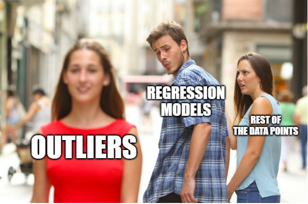

# AutoPricer

## Background and motivation
It can be difficult to assess whether the price of a car is too high or if you are selling your car for too low when buying it.

We wanted to create a model that could as accurately as possible predict the price of an arbitrary car with a model year no older than ~1990. We achieved this with the dataset (Car Features and MSRP | Kaggle). The idea was to train a model on a car's more “basal” features like cylinder amount, car brand, driven wheels, etc. We hoped to see what underlying features would or would not significantly influence a car’s price and to have more “objective” measurements of a car's value. Car retailers could use the results of this project to set the price of their cars more effectively, as well as help consumers determine whether the price of a car is fair.

## Dataset
The dataset we used consists of 11684 rows, each representing a unique car and having 16 columns.

The dataset was put together by the user Cooperunion on Kaggle in 2017. Thus, the dataset contains cars up to 2017, and the prices are also represented by 2017 prices. Also noteworthy is that Edmunds is an American company; thus, the price is denoted in USD.

The data was mostly scraped from the car retailer Edmunds. On its website, Edmunds has an application that lets users appraise their cars based on different parameters. These parameters are some of the features found in our dataset.

The feature “Popularity” was scraped from Twitter, representing how much a specific car is discussed.

## Methodology
The main goal with this project was to predict the price of cars by using the dataset mentioned above, using different methods for Unsupervised- & Supervised learning, dimensionality reduction/feature selection. Before starting with any machine learning, we explored our dataset, ultimately cleaning it as you will see further down in the code section of the report. The Unsupervised methods we used were clustering, in particular, we tried KModes & KPrototypes. KPrototypes is a combination of KModes and KMeans clustering. This was chosen because it can be used on datasets with mixed data types, to see if we could see any similarities between our data points. We used principal component analysis (PCA) to visualise and reduce dimensions for our numerical features.

We used different regression algorithms to predict the price, specifically “least absolute shrinkage and selection operator” (LASSO), linear regression, and Random Forest Regression. Lasso is a modified linear regression that tries to use as few parameters as possible to fit a line. The Random Forest consists of many decision trees that predict the price and then return the average of the predictions.

Before actually applying the different algorithms, we split the dataset into a training set, an evaluation set, and a test set. The evaluation set was used to fine-tune the parameters before testing it on the test set. This is to estimate better how well our model would generalize to new, unseen data if ever to be deployed into the real world. Before actually training our model, we also one-hot encoded (OHE) our categorical features, meaning that every categorical value becomes a feature of a data point with the value 0 or 1. E.G., if a datapoint has the make-value “Volvo”, it instead gets a feature called “Is Volvo” with the value 1 (it also gets, for example, a feature called “Is Ford” with the value 0).

To evaluate the project, we mainly looked at the resulting RMSE (Root Mean Squared Error) of the predictions and the R2 score, which describes the amount of variance the regression model can explain. We also looked at the prediction of the actual price and the logarithmic price.

## Conclusion
Our model performs admirably considering the huge difference between many of the cars and their idiosyncrasies. The RMSE is not insignificant since it exceeds the list price of some of the cars in the dataset. However, when the price range (and very sparse in the higher price classes) is this wide, then minimising the mean squared error becomes very difficult.
